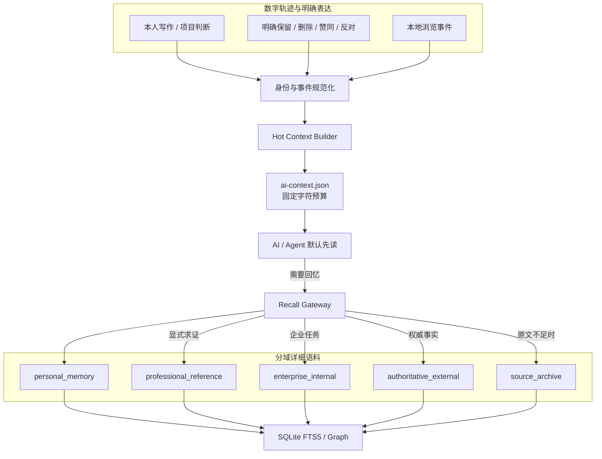

# Personal Knowledge Hub：双层记忆架构

> 版本：v2.0
>
> 状态：第一阶段已实现
>
> 原则：先让 AI 低成本理解用户，再按需进入详细记忆与外部证据

## 1. 结论

个人第二大脑不应该首先追求“拥有最多文章”。基础模型已经具备大量通用知识；把更多公众号和研究报告长期塞进上下文，通常只会增加成本、噪声和身份混淆。

本项目采用两个读取层级：

1. **Hot Context / 个人上下文快照**

   一个小型、版本化、可审计的 JSON。Agent 每次任务可以先读取它，快速了解用户长期主题、近期本人记录、明确偏好和仅作观察的阅读轨迹。

2. **Recall / 详细记忆检索**

   只有问题需要“我何时这样想、为什么、原始记录在哪里”时，才检索详细个人记忆。专业研究、企业事实和冷原文再作为独立证据域按需加入。

语料域与读取层是两个不同维度：

- 读取层决定“现在加载多少”；
- 语料域决定“这是谁的内容、能否代表用户、具有什么权限”。

## 2. 目标架构



## 3. 身份轴：内容不等于人格

每份资料至少包含以下字段：

```yaml
corpus_namespace: personal_memory
authorship: self
confidentiality: private
engagement_status: read
stance: unreviewed
persona_influence: 1.0
```

规则：

- 只有显式声明为 `personal_memory + authorship=self + persona_influence>0` 的内容可以进入本人记忆摘要；
- `professional_reference`、`enterprise_internal`、`authoritative_external` 和 `source_archive` 的 `persona_influence` 强制为 `0`；
- 外部文章即使位于本机、被打开或被收藏，也不能自动变成“用户观点”；
- 企业资料代表组织事实，不代表用户个人立场；
- 冷原文只用于回溯，不进入常驻上下文。

## 4. 第一层：Hot Context

### 4.1 目标

- Agent 在不扫描整个 Vault 的情况下快速获得必要个人背景；
- 默认 JSON 小于约 6,000 字符；
- 不包含全文、原始 URL、Cookie、本机路径或外部文章库存；
- 每个信号标明证据等级；
- 浏览行为与本人判断严格分开。

### 4.2 当前契约

```json
{
  "schema_version": 1,
  "generated_at": "2026-07-29T10:00:00+08:00",
  "identity_boundary": {
    "confirmed_self": "user-authored personal memory",
    "observed_behavior": "attention signal only",
    "external_reference": "retrieval only"
  },
  "confirmed_self": {
    "note_count": 12,
    "top_themes": [],
    "top_concepts": [],
    "recent_memories": []
  },
  "explicit_preferences": {},
  "observed_trajectory": {
    "meaning": "never agreement, belief, mastery, or authorship",
    "topic_signals": [],
    "recent": []
  },
  "retrieval_policy": {},
  "context_budget": {
    "default_max_chars": 6000,
    "full_articles_in_hot_context": 0
  }
}
```

### 4.3 数据来源

可信本人信号：

- 本人写作、日记、作品、项目复盘；
- 明确的保留、删除、赞同、反对、应用反馈；
- 本人创建的批注与判断。

观察信号：

- 打开过的页面；
- 搜索或浏览主题；
- 最近关注轨迹。

观察信号只能帮助 Agent 说：

> “你最近似乎在关注 Agent 记忆；这只是根据浏览行为观察到的兴趣候选。”

不能帮助 Agent 说：

> “你认同该文章”或“你的观点是该作者的观点”。

## 5. 第二层：Recall

### 5.1 路由策略

| 查询意图 | 第一检索域 | 可选增强 | 默认禁止 |
|---|---|---|---|
| 我过去怎么想 | `personal_memory` | 显式请求后加入专业证据 | 用外部文章替代缺失记忆 |
| 行业资料怎么说 | `professional_reference` + `authoritative_external` | 冷原文 | 冒充用户观点 |
| 企业事实是什么 | `enterprise_internal` | 权威外部事实 | 未授权企业内容外泄 |
| 综合决策 | 个人判断 + 企业事实 | 外部方法与反例 | 混淆三者身份 |
| 查原文依据 | 指定域 + `source_archive` | 无 | 默认展开全部全文 |

### 5.2 返回契约

```json
{
  "query": "我过去如何判断 Agent 记忆",
  "intent": "personal_recall",
  "route": ["personal_memory"],
  "memories": [
    {
      "title": "我的 Agent 记忆判断",
      "snippet": "...",
      "identity": {
        "namespace": "personal_memory",
        "represents_user": true
      },
      "temporal": {
        "date": "2026-07-28T09:00:00+08:00",
        "date_kind": "curated"
      },
      "citation": {
        "title": "...",
        "source_url": "",
        "date": "...",
        "local_note": "..."
      }
    }
  ],
  "evidence": [],
  "boundary": "External evidence never represents the user's view.",
  "context_budget": {
    "full_articles_loaded": 0,
    "archive_fallback": false
  }
}
```

无个人命中时必须返回：

> 没有找到相符的本人记录；系统不会用外部文章替代缺失的个人记忆。

### 5.3 时间语义

当前检索索引保存：

- `publish_date`：内容发布或原始记录日期；
- `curated_at`：整理进入知识层的时间。

后续版本将增加：

- `observed_at`：浏览/阅读事件时间；
- `valid_from` / `valid_to`：判断有效期；
- `supersedes`：新判断替代旧判断；
- `as-of` / `since` 查询过滤。

## 6. 活动事件模型

浏览器历史应该进入活动账本，而不是直接进入人格。

推荐事件结构：

```yaml
event_id: sha256(...)
event_type: viewed          # viewed | wrote | annotated | decided | applied
observed_at: 2026-07-29T10:00:00+08:00
source_app: wechat_desktop
source_hash: sha256(url)
title: ...
evidence_level: observed
stance: unknown
persona_influence: 0
```

当前微信 watcher 已采用以下治理：

- 只有显式设置本地环境开关才会启动，历史状态文件不代表授权；
- 首次启动建立基线；
- 只读取新增公众号页面；
- 私有状态中只为 AI 上下文保留标题、时间和 URL 哈希；
- 有界保留最近事件；
- 轨迹读取不触发昂贵的全量图谱重建；
- `GET /api/context` 会实时叠加最新轨迹。

## 7. 热、温、冷三级存储

| 层级 | 内容 | 存储 | 加载策略 |
|---|---|---|---|
| 热层 | AI 个人上下文、少量近期本人记忆 | 小型 JSON / Markdown | 每个相关任务先读 |
| 温层 | 精炼本人记忆、专业资料、企业事实 | 分域 SQLite FTS5 + 图谱 | 查询时加载片段 |
| 冷层 | 未精读全文、低优先级历史 | Markdown / archive FTS | 明确回溯时加载 |

内存原则：

- 热层不保存全文；
- 检索结果默认只返回短 snippet；
- 每个路由有固定结果配额；
- 外部证据必须显式加入；
- 冷库不自动进入图谱；
- 跨域弱关系不写入正式 Obsidian 图谱；
- 重建任务使用阈值和防抖，不随每个浏览事件触发。

## 8. 图谱治理

Obsidian 图谱用于探索，不承担在线检索引擎职责。

正式关系应满足至少一项：

- 显式引用；
- 两个以上独立概念相符并达到较高相似阈值；
- 经整理的外部方法与本人项目存在明确迁移语义；
- 用户确认支持、冲突、补充或应用关系。

以下关系不能进入正式图谱：

- 同一公众号但无语义证据；
- 只有表面关键词；
- 未精读外部文章直接连到本人项目；
- 低分跨域相似；
- 把任意 `personal_memory` 都当作“项目”。

未来节点模型：

```text
source article
  ├─ claim
  ├─ concept
  ├─ method
  └─ case

personal memory
  ├─ decision
  ├─ project
  └─ reflection
```

关系至少包括 `supports`、`complements`、`contradicts`、`applies_to`、`derived_from` 和 `supersedes`，并保留证据锚点与置信度。

## 9. 高效检索演进

当前已实现：

- namespace-aware SQLite FTS5；
- 个人/专业/企业/权威/冷库范围过滤；
- 个人回忆自动路由；
- 时间与 citation 字段；
- 结果配额与全文零加载；
- 冷库显式回溯。

推荐长期方案：

1. 文档按标题结构切成 Chunk；
2. 每个 namespace 使用独立向量 collection；
3. FTS/BM25 与向量召回分别产生候选；
4. 通过 RRF 融合；
5. 按身份、证据质量、时效和问题意图重排；
6. 同来源、同结论去冗余；
7. 图谱只做一跳强关系扩展；
8. 按 Token 预算组装最终 Agent context。

建议默认预算：

| 内容 | 比例 |
|---|---:|
| 用户目标与相关个人记忆 | 35% |
| 当前任务/企业事实 | 25% |
| 外部方法与证据 | 25% |
| 引用、反例和不确定性 | 15% |

## 10. 增量更新与内存治理

长期方案使用：

```text
content_hash + parser_version + embedding_version
```

只更新发生变化的文档、Chunk、向量与一跳关系：

```text
新文件
→ 计算哈希
→ 规范化
→ 更新对应 namespace
→ 更新受影响 Chunk
→ 重算一跳候选关系
→ 原子切换索引
```

避免：

- 每次删除并重建全部表；
- 每轮读取所有 Markdown；
- 高频 `VACUUM`；
- 一篇文章变化触发全图重算；
- 全量 O(n²) 文档相似度；
- 正文长期在 Markdown 与数据库重复双份常驻。

## 11. 停采与“赛博蒸馏”边界

专业语料库的目标是提供证据，不是重新训练一个通用大模型。

从主动扩张转为按需增量的条件：

- 最近样本的新概念率持续很低；
- 高价值新增比例持续下降；
- 重复结论比例持续上升；
- 真实任务的问题覆盖率达到目标；
- 核心结论已有多来源互证；
- 该主题长期没有被真实任务调用。

外部研究可以保留为冷/温证据，但默认不做：

- 全量逐篇蒸馏；
- 持续占用个人图谱；
- 自动塑造用户画像；
- 每次任务全部加载；
- 仅以“文章更多”作为成熟度。

## 12. 本地接口

CLI：

```text
knowledge_agent_cli.py context --max-chars 6000
knowledge_agent_cli.py recall "我过去如何判断..." [--include-evidence]
knowledge_agent_cli.py search "query" --scope personal
knowledge_agent_cli.py search "query" --scope professional
knowledge_agent_cli.py search "query" --scope enterprise
knowledge_agent_cli.py rebuild
knowledge_agent_cli.py status
```

HTTP：

```text
GET /api/context
GET /api/recall
GET /api/search
GET /api/status
```

服务强制绑定本机回环地址；第一阶段不提供公网 API。

## 13. 隐私与开源边界

开源仓库只包含：

- 源码；
- 示例配置；
- 虚构测试数据；
- 匿名截图；
- 架构与部署文档。

私有运行目录包含：

- Vault 正文；
- 浏览轨迹和 URL 哈希；
- SQLite 索引；
- 队列、日志、偏好与回收区；
- Cookie、Token、登录态和私有配置。

模型边界：

- 正文与索引默认本地；
- 如果启用云端 LLM/OCR，提交给 provider 的片段受其数据政策约束；
- 需要完全离线时只使用本地 provider。

## 14. 验收标准

第一阶段：

- [x] Hot Context 有固定字符预算；
- [x] 外部库存不能进入个人摘要；
- [x] 浏览只产生观察信号；
- [x] Agent 可通过 CLI/API 获取摘要；
- [x] “我过去怎么想”只先查本人记忆；
- [x] 外部证据必须显式加入；
- [x] 返回时间、namespace、`represents_user` 和 citation；
- [x] 缺少本人记忆时不使用外部文章冒充；
- [x] 微信 watcher 严格显式授权，状态文件只恢复进度；
- [x] 本地服务不能绑定非回环地址。

后续阶段：

- [ ] 可编辑、确认、拒绝和删除单条画像断言；
- [ ] 观点版本与 `as-of` 时间回忆；
- [ ] Chunk 级证据锚点；
- [ ] 向量召回、RRF 与 reranker；
- [ ] 企业调用方权限校验；
- [ ] 增量索引和影子切换；
- [ ] MCP Server。

## 15. 最终产品定义

> 一个本地优先、数据归用户所有、代码可以开源的 AI 记忆层：平时只用一个很小的上下文让 Agent 了解你；需要追溯时，才从带时间和出处的个人记忆中寻找答案；需要专业性时，再引入边界明确的外部证据。

它不是文章收藏夹，也不是把外部语料伪装成人格的 RAG。它的核心价值是：**让 AI 更懂你，同时让“为什么这样理解你”始终可解释、可纠正、可遗忘。**
