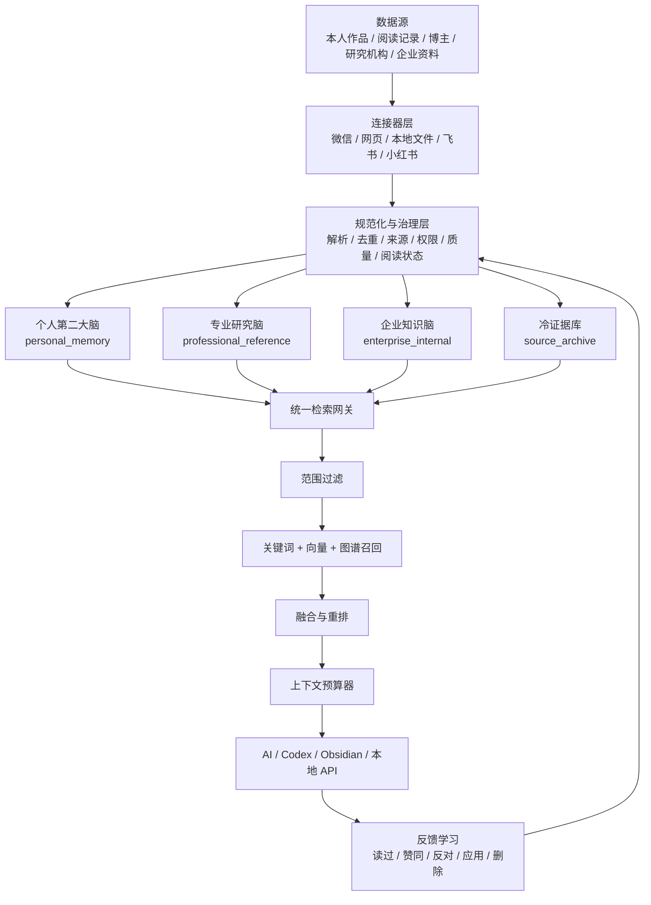

# 第二大脑与专业研究脑：整体架构方案

> 版本：v1.0  
> 日期：2026-07-27  
> 状态：方案稿，先确定边界与演进顺序，不在本阶段迁移现有数据

## 1. 结论先行

这个项目不应继续被定义为“把所有好文章放进同一个 Obsidian 知识库”，而应升级为一个可复用的本地知识操作系统：

1. **开源内核**：只包含源代码、接口、数据模型、测试、示例和部署说明，可以安全分享和开源。
2. **个人第二大脑**：只承载用户本人写过、读过、批注过、实践过或明确表态过的内容，决定 AI 如何理解“我是谁、我怎样判断”。
3. **专业研究脑**：承载腾讯研究院、喜欢的博主、论文、报告等外部语料，用来提升事实密度、专业性和研究能力，但默认不代表用户读过或认同。
4. **企业知识脑**：未来接入 NEX 企业资料、Wiki、制度与项目事实，必须与个人和外部研究保持权限、引用与事实边界。
5. **冷证据库**：保留可回溯原文，但不进入核心图谱，也不默认占用 AI 上下文。

核心原则是：

> 个人语料决定立场与偏好，专业语料提供方法与证据，企业语料提供组织事实；三者可以联合检索，但不能混淆身份。

## 2. 当前系统基线

本方案基于当前项目的只读审计：

- 项目路径：`<project-root>`
- Obsidian 路径：`<obsidian-vault>`
- 当前本地索引：`data\knowledge-index.sqlite3`
- 当前索引大小：约 197 MB
- 原始证据条目：8,497
- 精炼知识条目：466
- 图谱关系：1,122
- 当前知识层：
  - personal：37
  - core：195
  - reference：97
  - brief：137

现有系统已经完成：

- 微信公众号、网页、本地资料等内容导入；
- 文章去重、质量评分、AI 精读和回收建议；
- 原始证据与精炼知识的初步分层；
- SQLite FTS5 全文检索；
- 基于词项、概念和显式链接的关系图；
- Obsidian 主题页、概念页、阅读画像和知识星球；
- 以新增精读数量、精选集合变化和时间间隔控制重建；
- 语料成熟度与停采判断。

当前系统尚未真正解决：

- `platform=local` 被近似视为个人内容，无法准确区分“本人作品”“导入的外部资料”“企业资料”；
- personal、专业研究和企业事实仍共用一套索引与关系空间；
- 当前主要是 FTS5 + 本地 TF-IDF 式关联，没有独立向量召回和语义重排层；
- 索引重建采用删表、重建、FTS 重建和 `VACUUM`，数据继续增长后成本会明显上升；
- 原文正文在 Markdown 与 SQLite 中重复保存，单库体积和重建内存压力较大；
- 源代码、运行产物、临时图片和个人路径仍位于同一项目目录，暂不适合直接开源；
- “外部文章影响用户人格”的边界还不够明确；
- 图谱关系更偏“文档相似”，尚未完全升级为“观点—概念—方法—案例—项目”的可验证关系。

## 3. 目标架构



### 3.1 四个语料域

| 语料域 | 典型内容 | 是否代表用户 | 默认检索权重 | 是否进入人格画像 |
|---|---|---:|---:|---:|
| `personal_memory` | 日记、随笔、作品、项目决策、本人批注 | 是 | 最高 | 是 |
| `professional_reference` | 腾讯研究院、喜欢的博主、论文、报告 | 否 | 按问题启用 | 否 |
| `enterprise_internal` | NEX 文档、Wiki、制度、项目事实 | 否，代表企业 | 企业任务中最高 | 否 |
| `source_archive` | 未精读原文、低优先级历史资料 | 否 | 最低，按需回溯 | 否 |

### 3.2 “读过”不能只用一个布尔值

外部内容是否能够影响个人第二大脑，应由认知状态控制：

```yaml
authorship: external       # self | external | enterprise
corpus_namespace: professional_reference
engagement_status: unread  # unread | skimmed | read | annotated | applied
stance: unreviewed         # unreviewed | agree | partial | disagree | rejected
persona_influence: 0.0     # 只有本人内容或明确确认后才能大于 0
```

建议的升级路径：

```text
外部原文
→ AI 精读
→ 用户读过
→ 用户批注或表态
→ 在项目中应用
→ 抽取为“我的判断”
→ 才能进入个人认知层
```

AI 可以引用未读的腾讯研究院文章，但必须表达为“外部研究认为”，不能表达为“你认为”。

## 4. 可开源代码与私有数据的物理隔离

### 4.1 开源仓库建议

```text
second-brain-core/
├─ pyproject.toml
├─ README.md
├─ LICENSE
├─ SECURITY.md
├─ .env.example
├─ config/
│  ├─ default.yml
│  ├─ corpus-policy.example.yml
│  └─ retrieval-policy.example.yml
├─ src/second_brain/
│  ├─ domain/             # 文档、chunk、来源、关系、反馈等领域模型
│  ├─ connectors/         # 连接器协议，不放用户凭证
│  ├─ ingestion/          # 解析、规范化、去重和增量更新
│  ├─ curation/           # 分类、精读、质量筛选和认知升级
│  ├─ storage/            # 元数据、正文存储和迁移
│  ├─ indexing/           # FTS、向量、图谱索引
│  ├─ retrieval/          # 路由、召回、融合、重排和上下文组装
│  ├─ graph/              # 节点、关系、验证和 Obsidian 映射
│  ├─ jobs/               # 增量任务、队列、锁和失败恢复
│  ├─ api/                # 本地 HTTP、CLI、MCP
│  └─ observability/      # 指标、日志和质量评估
├─ plugins/
│  ├─ wechat/
│  ├─ web/
│  ├─ local_files/
│  ├─ feishu/
│  └─ xiaohongshu/
├─ migrations/
├─ tests/
├─ examples/
│  └─ demo_vault/         # 只放人工生成的虚构示例
└─ docs/
   ├─ architecture.md
   ├─ metadata-schema.md
   ├─ retrieval.md
   └─ privacy.md
```

### 4.2 私有运行目录建议

所有真实数据都移出 Git 仓库，通过 `SECOND_BRAIN_HOME` 指定：

```text
SECOND_BRAIN_HOME/
├─ config/
│  ├─ user.yml
│  └─ corpus-policy.yml
├─ vault/
│  ├─ personal/
│  ├─ professional/
│  ├─ enterprise/
│  └─ archive/
├─ objects/               # 内容寻址的规范化正文
├─ metadata/
│  └─ metadata.sqlite3
├─ indexes/
│  ├─ personal/
│  ├─ professional/
│  ├─ enterprise/
│  └─ archive/
├─ graph/
├─ queues/
├─ cache/
├─ logs/
├─ backups/
└─ secrets/               # Cookie、Token、凭证；永不进入日志和仓库
```

代码仓库只读取配置中的路径，不再硬编码某台电脑的用户名、Vault 或项目绝对路径。

### 4.3 开源前必须忽略

```gitignore
.env
.env.*
!.env.example
data/
vault/
objects/
indexes/
queues/
cache/
logs/
tmp/
secrets/
*.sqlite
*.sqlite3
*.sqlite3-wal
*.sqlite3-shm
*.db
*.log
*.pid
*.png
*.jpg
*.jpeg
.obsidian/workspace*.json
```

同时增加发布检查：

- 扫描 API Key、Cookie、Token、邮箱、手机号和绝对用户路径；
- 检查 Git 历史，而不只是当前文件；
- 测试包只能使用虚构数据；
- 微信原文、公众号文章和企业文档不得随代码发布；
- 单独说明连接器代码的许可与第三方平台使用边界。

## 5. 统一数据模型

### 5.1 文档级元数据

```yaml
document_id: "doc_sha256"
content_hash: "sha256:..."
version: 3

corpus_namespace: "personal_memory"
authorship: "self"
confidentiality: "private"
source_status: "primary"

title: "..."
author: "..."
source_name: "..."
source_url: "..."
published_at: "..."
collected_at: "..."
language: "zh-CN"

document_type: "reflection"
knowledge_type: "观点见解"
quality_score: 92
priority: "重点"

engagement_status: "annotated"
stance: "agree"
persona_influence: 1.0
mastery_status: "applied"

summary: "..."
evidence_boundary: "..."
topics: []
concepts: []
projects: []
```

### 5.2 Chunk 级结构

```yaml
chunk_id: "document_id:version:0007"
document_id: "doc_sha256"
chunk_index: 7
heading_path: ["第二部分", "检索策略"]
text: "..."
token_count: 386
content_hash: "sha256:..."

source_url: "..."
citation_anchor: "第二部分/检索策略#p3"
published_at: "..."
corpus_namespace: "professional_reference"
confidentiality: "public_external"
```

### 5.3 关系模型

关系不能只保存一个相似度分数，应明确语义与证据：

```yaml
edge_id: "edge_sha256"
source_id: "..."
target_id: "..."
relation_type: "supports"
relation_types:
  - supports       # 互证
  - complements    # 补充
  - contradicts    # 冲突
  - applies_to     # 方法迁移到项目
  - derived_from   # 用户判断源于某证据
  - example_of     # 案例属于某概念
  - supersedes     # 新版本替代旧版本
evidence: ["chunk_id:..."]
confidence: 0.84
created_by: "model"
review_status: "unreviewed"
```

只有存在明确段落证据或用户确认时，才建立 `supports`、`contradicts`、`derived_from` 和 `applies_to`。普通文本相似只能生成候选关系，不直接写成事实关系。

## 6. 高效检索增强架构

### 6.1 先路由，再检索

检索网关先判断问题属于哪类：

| 查询类型 | 首选语料 | 次选语料 | 默认禁用 |
|---|---|---|---|
| “我过去怎么想” | personal | 已确认的阅读批注 | 未读外部文章 |
| “这个行业怎么判断” | professional | personal | archive |
| “NEX 的事实是什么” | enterprise | authoritative_external | personal |
| “帮我综合决策” | personal + enterprise + professional | archive 回溯 | 无 |
| “查原文依据” | 指定 namespace + archive | 无 | 无 |

路由结果必须随答案返回，至少包含：

- 使用了哪些语料域；
- 每个域命中了多少条；
- 哪些内容代表用户本人；
- 哪些是外部研究或企业事实。

### 6.2 分阶段召回

推荐流程：

1. **元数据过滤**：namespace、权限、日期、语言、来源状态、阅读状态；
2. **关键词召回**：SQLite FTS5/BM25，适合名称、术语、标题和精确事实；
3. **向量召回**：按 namespace 独立索引，找语义相关段落；
4. **图谱扩展**：只扩展一跳强关系，避免图谱爆炸；
5. **结果融合**：使用 RRF 或加权融合，避免单一召回方式垄断；
6. **重排**：结合问题相关性、语料身份、证据强度、时效性和用户确认状态；
7. **去冗余**：同一来源、同一事件、同一结论只保留代表性 chunk；
8. **上下文组装**：按 Token 预算组织个人判断、专业方法、企业事实和原文引用。

### 6.3 推荐评分

```text
final_score =
  0.36 × semantic_relevance
  + 0.22 × lexical_relevance
  + 0.12 × evidence_quality
  + 0.10 × source_authority
  + 0.08 × freshness_fit
  + 0.07 × engagement_signal
  + 0.05 × graph_support
  + namespace_policy_boost
```

其中：

- `persona_influence` 只能影响“个人偏好类”回答，不能提升事实正确性；
- `enterprise_internal` 只能在企业任务中获得事实优先级；
- `professional_reference` 可以提高专业性，但不能覆盖用户明确表达的价值偏好；
- `source_archive` 只在核心知识不足或需要原文回溯时启用。

### 6.4 上下文预算

不要把检索到的正文全部交给模型。建议默认预算：

| 内容 | 预算比例 |
|---|---:|
| 用户目标、偏好与相关个人记忆 | 25% |
| 企业事实或当前任务材料 | 30% |
| 外部专业方法与证据 | 30% |
| 引用、反例与不确定性 | 15% |

简单问题使用 2,000–4,000 Token；研究问题使用 8,000–16,000 Token。只有明确需要时才展开原文。

## 7. 内存、磁盘与增量更新

### 7.1 热、温、冷三级存储

| 层级 | 内容 | 存储方式 | 加载策略 |
|---|---|---|---|
| 热层 | 用户画像、项目状态、核心概念、近期高价值知识 | 小型 SQLite/JSON + 缓存 | 常驻或按会话加载 |
| 温层 | 精读文章、chunk、向量、强关系 | 分 namespace 索引 | 查询时按需加载 |
| 冷层 | 8,000+ 原文与低价值内容 | 压缩正文/对象存储 + FTS | 只做证据回溯 |

### 7.2 避免全文双份常驻

当前 Markdown 和 SQLite 都保存全文。推荐改成：

- Markdown/对象存储是正文权威来源；
- metadata SQLite 保存元数据、摘要、路径和哈希；
- FTS 保存必要检索字段或独立压缩正文；
- 向量索引只保存 chunk ID 与向量；
- 查询命中后再按路径读取少量正文；
- 冷库正文不参与图谱构建，也不在重建时整体加载。

### 7.3 增量索引

用 `content_hash + parser_version + embedding_version` 判断是否需要更新：

```text
新文件
→ 计算哈希
→ 规范化
→ 只更新改变的文档和 chunk
→ 更新对应 namespace 的 FTS/向量
→ 只重算受影响节点的一跳关系
→ 原子切换新索引
```

避免每次：

- 删除并重建全部表；
- 重读所有 Markdown；
- 全量计算文档两两相似度；
- 每轮执行大型 `VACUUM`；
- 因一篇文章变化而重写整个知识图谱。

### 7.4 进程内存控制

- 文件解析使用流式迭代器；
- 队列设置固定批次和最大并发；
- embedding 批次按 Token 而非文件数控制；
- 图谱候选先经倒排索引筛选，禁止全量 O(n²) 比较；
- 每个 namespace 独立缓存并设置 LRU 上限；
- 长文先按标题结构切片，再处理单个 chunk；
- 定时任务只做增量，重建任务使用单实例锁；
- 失败任务进入可恢复队列，不能阻塞整个索引；
- 记录峰值内存、索引耗时、召回耗时和无结果率。

## 8. 图谱与 Obsidian 的定位

Obsidian 图谱适合浏览和发现，不应承担在线检索数据库的职责。

建议将图谱拆成四类视图：

1. **我的认知图谱**：只显示本人内容、明确阅读和已确认迁移关系；
2. **专业研究图谱**：显示外部文章—观点—方法—案例；
3. **企业知识图谱**：显示企业文档—项目—产品—客户—事实；
4. **联合探索图谱**：临时展示跨域连接，但用颜色和关系类型标识边界。

默认 Obsidian 图谱只展示核心节点和强关系：

- 隐藏冷证据库；
- 隐藏速览和回收建议；
- 不显示无关系节点；
- 单节点最多保留 5–8 条高质量自动关系；
- 相似文章之间不重复连边；
- 低置信自动关系进入候选列表，不写入正式图谱。

## 9. 面向 AI 的调用接口

第一阶段不需要公网 API，但要形成稳定的本地协议：

```text
second-brain search "问题" --scope personal
second-brain search "问题" --scope professional
second-brain search "问题" --scope enterprise
second-brain ask "问题" --profile user --citations
second-brain feedback <result-id> --read --agree
second-brain rebuild --changed-only
```

建议同时提供：

- Python SDK：供现有程序调用；
- 本地 HTTP API：供站点前端调用；
- MCP Server：供 Codex、Claude Desktop 等 Agent 调用；
- Obsidian 命令：打开原文、标记读过、批注、赞同、反对和应用到项目。

最小检索返回结构：

```json
{
  "query": "Agent 记忆应该怎样设计？",
  "route": ["personal_memory", "professional_reference"],
  "results": [
    {
      "chunk_id": "doc:3",
      "corpus_namespace": "personal_memory",
      "identity": "user_authored",
      "title": "我的知识中枢设计",
      "snippet": "...",
      "score": 0.91,
      "citation": "..."
    }
  ]
}
```

## 10. 质量评价与停采标准

继续抓取的目标不是“文章更多”，而是提高可回答问题的覆盖率。

### 10.1 每个语料域分别评价

个人第二大脑关注：

- 核心项目、偏好和重要决定是否有记录；
- 是否能准确复述用户的理由，而不只是结论；
- 是否能区分当前观点与过去观点；
- 是否有足够反例防止人格标签固化。

专业研究脑关注：

- 主题覆盖率；
- 一手来源比例；
- 高价值框架和案例的新颖率；
- 重复结论比例；
- 引用完整性和时效性。

企业知识脑关注：

- 权威文档覆盖率；
- 版本与有效期；
- 权限正确率；
- 问答命中率、引用正确率和拒答正确率。

### 10.2 建议停采条件

某主题满足以下条件后，自动从“主动扩张”转为“按需增量”：

- 最近 100 篇中新概念率低于 5%；
- 高价值文章比例低于 15%；
- 重复结论比例高于 60%；
- 评估问题覆盖率超过 85%；
- 已有至少 3 个独立高质量来源支持核心结论；
- 近 30 天没有真实任务召回该主题，或召回后没有进入最终答案。

腾讯研究院适合作为专业研究脑的历史资料库，不再要求逐篇进入个人图谱；只对新文章、被真实问题命中的文章和用户主动标记的文章精读。

## 11. 从当前项目迁移的最小方案

### 阶段 0：冻结历史扩张

- 保留现有数据和 Obsidian；
- 停止无目标全量抓取；
- 只做手动导入和必要增量；
- 当前索引继续可用。

### 阶段 1：代码与数据解耦

- 引入 `SECOND_BRAIN_HOME`；
- 把 `data`、`tmp`、日志、SQLite 和凭证移出仓库；
- 删除代码中的固定用户名和固定 Vault 假设；
- 补充配置模板、许可证和开源安全检查；
- 将现有脚本整理成 Python package，但保持兼容命令。

验收标准：

- 复制纯代码仓库到另一台电脑后，可使用虚构样例运行测试；
- 仓库中没有真实文章、个人文件、企业资料、Cookie 或绝对用户路径；
- 用户现有数据无需搬动即可通过配置挂载。

### 阶段 2：显式语料命名空间

- 增加 `corpus_namespace`、`authorship`、`confidentiality`；
- 将当前 `local` 内容逐项映射为 personal、professional 或 enterprise；
- 将腾讯研究院与博主内容映射为 `professional_reference`；
- 未精读文章映射为 `source_archive`；
- 企业内容映射为 `enterprise_internal`。

验收标准：

- 任一检索结果都能说明身份和来源；
- 未读外部文章不会进入“我的观点”；
- 企业事实不会被外部文章覆盖。

### 阶段 3：检索网关

- 把现有 `knowledge_graph.search()` 拆为 namespace-aware retrieval；
- 保留 FTS5；
- 新增可替换的 embedding provider 与每域独立向量索引；
- 实现查询路由、RRF 融合、去冗余和上下文预算；
- 返回引用与语料身份。

验收标准：

- 个人问题优先命中个人语料；
- 专业问题能调用专业研究脑；
- 企业问题只在授权范围内命中企业资料；
- 无答案时能够明确拒答或进入冷库回溯。

### 阶段 4：增量索引与图谱

- 正文改为内容寻址；
- 仅对变化文档重新切片和 embedding；
- 关系图只重算受影响节点；
- 使用影子索引和原子切换；
- 取消高频全库 `VACUUM`。

验收标准：

- 新增一篇文章不触发全量重建；
- 峰值内存和重建时间有监控；
- 任何任务中断后均可安全续跑；
- 索引损坏可从正文和元数据重建。

### 阶段 5：个人认知学习

- 前端增加“读过、赞同、部分赞同、反对、应用、忽略”；
- 把批注和项目应用转成显式关系；
- 建立“外部观点 → 我的判断”的推导记录；
- 定期生成可编辑的个人画像，不从浏览行为直接武断推断人格。

验收标准：

- AI 能区分“用户明确说过”与“根据阅读行为推测”；
- 每个个人偏好可以回溯到原始记录；
- 用户能删除或修正错误画像；
- 删除反馈不会直接训练不可解释的黑盒权重。

## 12. 推荐实施顺序

下一步优先级不是继续扩充文章，而是：

1. 完成代码与数据物理隔离；
2. 引入显式语料命名空间和身份字段；
3. 重构查询为“先路由、再分域检索”；
4. 再做向量召回、增量索引和内存优化；
5. 最后完善个人反馈学习和联合图谱。

其中第一、二步完成后，项目就具备初步开源条件；第三、四步完成后，才真正成为高效、可扩展、可供 Agent 长期调用的第二大脑系统。

## 13. 本方案暂不做的事情

- 不立即迁移或删除现有文章；
- 不重新抓取腾讯研究院历史；
- 不把所有文章重新 embedding；
- 不把个人、企业和外部资料直接混入同一个向量 collection；
- 不用浏览记录自动推断用户赞同；
- 不把 Obsidian 可视化图谱当作在线 RAG 引擎；
- 不为了“看起来智能”建立无法解释的弱关系。

## 14. 最终产品定义

这个系统最终应当是：

> 一个本地优先、数据归用户所有、代码可开源、语料可分域、证据可追溯、能够被不同 Agent 调用，并且会随着用户真实阅读、表达和实践逐渐成长的个人知识操作系统。

它既不是单纯的文章收藏夹，也不是把外部资料伪装成用户人格的 RAG。它由三个相互协作但边界清楚的大脑组成：

- **个人第二大脑**回答“我是谁、我怎样做判断”；
- **专业研究脑**回答“外部世界有哪些可靠方法和证据”；
- **企业知识脑**回答“组织内部目前有哪些有效事实和规则”。

统一检索负责把它们组合起来，引用与身份边界负责防止它们混在一起。
