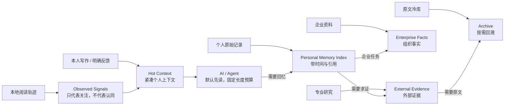

<div align="center">

# Personal Knowledge Hub

**Local-first context and citable recall for people and AI agents.**

[](https://www.python.org/)
[](https://www.sqlite.org/)
[](#privacy--隐私边界)
[](LICENSE)

</div>


Personal Knowledge Hub keeps personal writing, reading signals, professional
research, and private source archives in separate governed corpora. It assembles
a compact context for routine agent work, then retrieves time-stamped,
source-linked memories only when requested.

> 将个人表达、阅读信号与研究资料分开治理，为 Agent 提供紧凑上下文，并在需要时返回带时间与来源的记忆。

Opening or saving an article is not treated as agreement, knowledge, or
authorship. The project keeps those distinctions explicit so an agent can
understand the user without confusing external material with the user's own
views.

## The two-lane design / 双层记忆架构



### 1. Hot Context：让 AI 快速懂你

- 只吸收 `personal_memory` 中本人创作且允许影响画像的内容；
- 加入“保留 / 删除”等明确反馈；
- 浏览历史只保存为 `observed_reading`，明确标注为弱兴趣信号；
- 不包含外部文章全文、URL、Cookie、本机路径；
- 默认限制在约 6,000 字符，适合 Agent 每次任务先加载。

### 2. Recall：需要时再追溯

- “我以前怎么想”只先检索本人记忆；
- 返回发布日期/整理时间、标题、来源和本地引用；
- 外部研究必须通过 `include_evidence` 显式加入，并单独返回；
- 如果没有本人记录，系统会明确说“没有找到”，不会拿公众号文章冒充你的想法；
- 原文冷库不默认展开，避免上下文和内存被大语料吞没。

## Features / 已实现能力

- **Compact AI Context**: 生成机器可读的个人上下文 JSON 和 Obsidian 可读视图，长度有硬上限。
- **Temporal Personal Recall**: 回忆本人过去的记录，返回时间、引用和语料身份。
- **Intent-aware Routing**: 区分个人回忆、专业研究与企业事实，不再把所有内容放进同一个排序池。
- **Safe Reading Signals**: 本地微信浏览轨迹只表示“看过/关注过”，绝不自动等同于赞同、掌握或作者身份。
- **Corpus Isolation**: `personal_memory`、`professional_reference`、`enterprise_internal`、`authoritative_external`、`source_archive` 五域隔离。
- **Local Retrieval**: SQLite FTS5 全文检索，结果带 namespace、`represents_user` 和 citation。
- **Governed Knowledge Graph**: Obsidian 双链与概念图谱；跨域关系采用更高阈值，弱相似不会直接写成人格关系。
- **ETL & Curation**: 内容解析、去重、质量打分、AI 整理队列、可恢复清理与 OCR 编排。
- **Local-first Runtime**: 正文、索引、队列、轨迹和偏好默认保存在本机私有运行目录。

> 当前项目提供的是 **Agent retrieval / context gateway**，不是内置大模型聊天产品。生成式回答由调用它的本地 Agent 完成。

## Screenshots / 效果展示

| Knowledge Graph | Web Console | Agent Context |
|---|---|---|
|  |  |  |
| 已连接的 Obsidian 知识星球 | 本地采集与任务状态 | 紧凑摘要 + 按需回忆 |

## Quick Start / 快速开始

### 1. Install

```powershell
git clone https://github.com/wulie0508-gif/personal-knowledge-hub.git
cd personal-knowledge-hub
python -m venv .venv
.\.venv\Scripts\python.exe -m pip install -r requirements.txt
```

### 2. Keep private data outside the repository

```powershell
$env:SECOND_BRAIN_VAULT = "D:\Your Obsidian Vault"
$env:SECOND_BRAIN_HOME = "D:\PersonalKnowledgeRuntime"
```

`SECOND_BRAIN_HOME` 保存索引、任务、轨迹、偏好与私有配置；Git 仓库只保存可分享的代码。更多变量见 [.env.example](.env.example)。

### 3. Start the local hub

```powershell
.\start.cmd
```

打开 [http://127.0.0.1:8765](http://127.0.0.1:8765)。服务强制绑定本机回环地址，避免无鉴权接口暴露到局域网。

### 4. Let an Agent understand or recall

```powershell
# 每次任务优先读取：小、快、不会混入通用研究语料
.\.venv\Scripts\python.exe knowledge_agent_cli.py context --max-chars 6000

# 回忆“我以前怎么想”，默认只查本人记录
.\.venv\Scripts\python.exe knowledge_agent_cli.py recall "我过去如何判断 Agent 记忆"

# 需要外部研究求证时再显式加入
.\.venv\Scripts\python.exe knowledge_agent_cli.py recall "我过去如何判断 Agent 记忆" --include-evidence

# 仍可直接按语料域检索
.\.venv\Scripts\python.exe knowledge_agent_cli.py search "知识管理" --scope personal
```

本地 HTTP 接口：

```text
GET /api/context?max_chars=6000
GET /api/recall?q=我过去如何判断Agent记忆&include_evidence=true
GET /api/search?q=知识管理&scope=personal
GET /api/status
```

完整字段语义与 Agent 调用边界见 [docs/AGENT_INTEGRATION.md](docs/AGENT_INTEGRATION.md)。

## WeChat workflows / 微信使用方式

### Desktop WeChat reading history

项目可选择监听**桌面微信内置 Chromium 浏览器中，新打开的公众号文章 URL**：

```powershell
$env:SECOND_BRAIN_WATCH_WECHAT_HISTORY = "1"
.\start.cmd
```

安全边界：

- 首次启动只建立当前位置基线，不自动回填全部旧历史；
- 只查询 `https://mp.weixin.qq.com/s/*`；
- 浏览轨迹在 AI 上下文中只保存标题、时间和 URL 哈希，不保存原始 URL；
- 页面被打开不代表读完，更不代表赞同；
- 默认不启用；只有明确设置环境开关才会启动；
- 私有状态文件只用于恢复扫描进度，不能代替用户授权。

### Articles read on a phone

电脑无法直接读取手机微信的浏览历史。最稳妥的方式是把文章转发给自己的**文件传输助手**，再使用可选的 `wechat-content-router-windows` 连接器处理“存入知识库”口令。

该连接器涉及微信本地进程读取，必须单独安装并显式启用：

```powershell
$env:SECOND_BRAIN_WATCH_FILEHELPER = "1"
.\start.cmd
```

核心仓库不会打包微信 Cookie、登录态或聊天数据，也不会扫描全部会话。

## Knowledge boundaries / 内容身份

| Namespace | 用途 | 代表用户本人 | 默认进入 Hot Context |
|---|---|---:|---:|
| `personal_memory` | 本人写作、项目判断、明确表达 | 是 | 是，但必须显式声明 namespace、`authorship=self` 且 `persona_influence>0` |
| `professional_reference` | 公众号、研究报告、论文、博主观点 | 否 | 否 |
| `enterprise_internal` | 企业文档、Wiki、制度与项目事实 | 否，代表组织 | 否 |
| `authoritative_external` | 政府、标准、官方数据 | 否 | 否 |
| `source_archive` | 未精读原文与冷证据 | 否 | 否 |

“收藏过”“打开过”“读过”和“赞同”是四种不同状态。只有本人创作或明确反馈能够进入可信个人摘要；外部内容永远保留来源身份。

旧版本中仅因“文件在本机”而被推断为个人资料的内容，不会自动进入 Hot Context。先运行 `corpus_namespace_audit.py`，再用 `personal_identity_migration.py` 按你确认的原始来源目录做可备份、默认 dry-run 的身份迁移。

## Tech Stack

| Layer | Technology |
|---|---|
| Runtime | Python 3.11+ |
| Storage & Search | SQLite, FTS5, Markdown |
| Personal Context | Versioned local JSON, bounded context assembly |
| Memory Routing | Namespace-aware recall, temporal citations |
| Knowledge Workspace | Obsidian, Wikilinks, Graph View |
| Parsing | Requests, lxml, BeautifulSoup, pypdf, python-docx |
| Optional Intelligence | AI curation / visual OCR provider, local OCR fallback |
| Interface | Local HTTP server, CLI, HTML / CSS / JavaScript |

## Project Structure

```text
personal-knowledge-hub/
├─ app.py                     # 本地 Web 中枢与 HTTP API
├─ personal_context.py        # 小型 AI 个人上下文
├─ personal_identity_migration.py # 旧个人资料的审计式身份迁移
├─ corpus_identity_migration.py # 混合目录的规则化分域迁移
├─ knowledge_graph.py         # 分域索引、回忆路由、引用与图谱
├─ knowledge_schema.py        # 五类语料域和身份边界
├─ knowledge_agent_cli.py     # Agent context / recall / search 入口
├─ wechat_history_watcher.py  # 可选的桌面微信阅读轨迹
├─ knowledge_pipeline.py      # 内容提取、清洗和质量流水线
├─ local_importer.py          # 本地资料导入
├─ tests/                     # 身份、预算、回忆与检索边界测试
└─ docs/                      # 架构、展示与安全说明
```

详细设计见 [ARCHITECTURE_PROPOSAL.md](ARCHITECTURE_PROPOSAL.md)。

## Privacy / 隐私边界

公开仓库只包含代码、示例配置、测试与匿名展示图；下列内容应始终留在本机并由 `.gitignore` 排除：

- Obsidian Vault、本人文章、企业资料与公众号全文；
- 微信聊天、浏览轨迹、URL、Cookie、Token、二维码与登录态；
- SQLite 索引、任务队列、日志、偏好、回收区和本地配置；
- `.env`、API Key、本机绝对路径与 Obsidian workspace 状态。

“Local-first”指正文、索引和默认运行状态留在本机。若你配置 Codex、云端 LLM 或云端 OCR 作为整理 provider，被提交给该 provider 的片段将遵循其数据政策；需要完全离线时请只启用本地 provider。

公开截图前请检查姓名、头像、微信号、浏览器标签、公司名称、文档标题、文件路径和系统通知。当前示例知识图谱截图不含 EXIF 元数据。

更多发布检查见 [OPEN_SOURCE_GUIDE.md](OPEN_SOURCE_GUIDE.md)。

## Roadmap

- [x] Compact AI Context：个人摘要、明确反馈、阅读弱信号与长度预算
- [x] Personal-first Recall：时间字段、引用契约、外部证据显式加入
- [x] 五类语料域隔离与冷原文回溯
- [x] 本地 FTS5、Obsidian 图谱与可恢复清理
- [ ] 可编辑/确认/删除单条画像断言
- [ ] `as-of` / `since` 时间过滤和观点版本演化
- [ ] Chunk 级引用、向量召回与可插拔 reranker
- [ ] 增量索引与影子切换，减少全量重建
- [ ] MCP Server 与更多浏览器/移动端事件连接器

## License

本项目采用 [MIT License](LICENSE)。你可以使用、修改、分发和商业化代码，但须保留版权与许可声明；软件按“原样”提供，不附带担保。

---

<div align="center">

Built by [Cassian](https://github.com/wulie0508-gif) for local-first human and agent workflows. Issues and pull requests are welcome.

</div>
