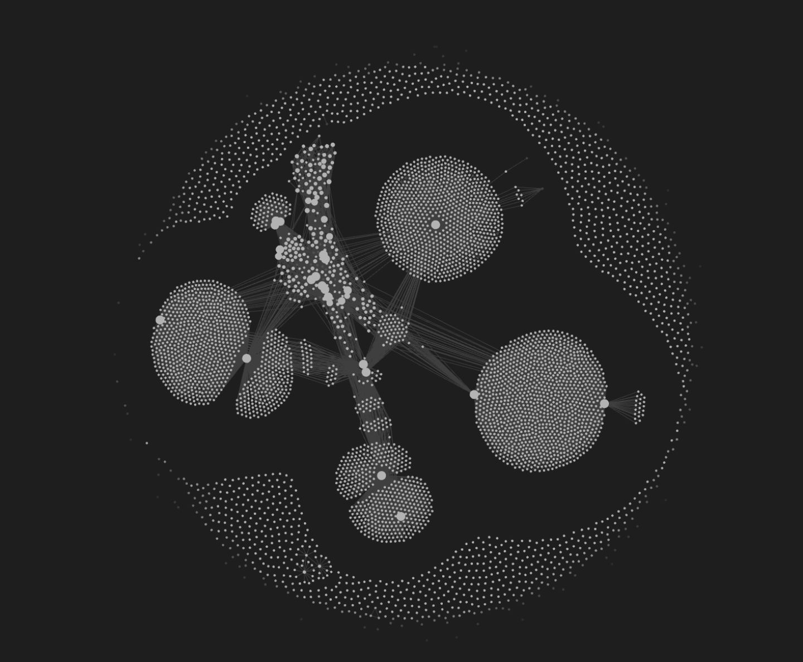
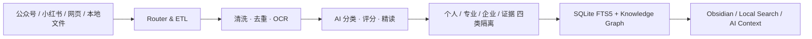
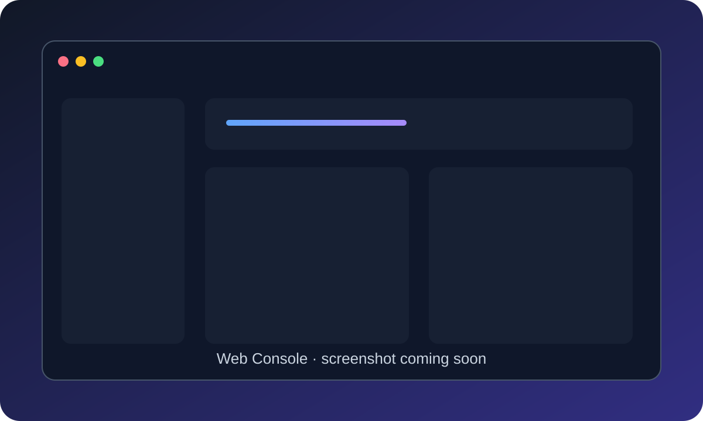
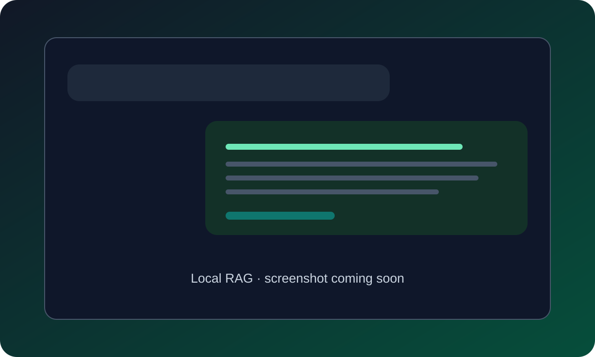

<div align="center">

# Personal Knowledge Hub

### 本地优先的个人 AI 知识中台 / RAG「第二大脑」

**A local-first AI knowledge hub that turns scattered reading into searchable, citable, and connected knowledge.**

[](https://www.python.org/)
[](https://www.sqlite.org/)
[](https://obsidian.md/)
[](https://www.markdownguide.org/)
[](#privacy--安全边界)
[](#quick-start--快速开始)

</div>



> **一句话价值主张**
>
> 把你刷过的公众号、小红书、网页和本地资料，沉淀成一个可检索、可引用、会建立联系、且完全运行在本机的 AI 知识库。

外部信息不应该只是“收藏过”，而应该变成未来可以再次调用的认知资产。Personal Knowledge Hub 将内容采集、清洗、质量判断、知识分层、关系构建和本地检索串成一条完整流水线，让 Obsidian 不只是文件夹，而是一套能为 AI 提供上下文的个人知识基础设施。

## Why / 为什么做

大多数收藏工具解决的是“存下来”，但没有解决三个更重要的问题：

- 哪些内容真正值得长期保留？
- 外部文章、个人观点和企业事实如何避免混在一起？
- AI 如何在需要时找到正确证据，并给出可回溯的引用？

这个项目的答案是：**Local-first ETL + AI Curation + Knowledge Graph + Retrieval**。



## Features / 核心能力

- 🔄 **多源内容采集** — 接入微信公众号、网页、本地文件，以及可选的小红书 / 飞书连接器。
- 🧹 **ETL 清洗与去重** — 统一正文、来源、作者、时间、URL 和内容哈希，减少重复与噪声。
- 🧠 **AI 分类与价值评分** — 区分观点、方法、案例、资料、资讯和营销内容，标记重点、参考、速览或回收建议。
- 👁️ **OCR 编排** — 优先使用模型视觉识别，必要时回退本地 OCR，提取图片中真正值得检索的信息。
- 🕸️ **知识图谱** — 构建“来源文章—观点—概念—方法—案例—项目”之间可解释的关系。
- 🔎 **本地 RAG 检索** — 基于 SQLite FTS5、概念关系和语料权重，为本地 AI / Agent 提供可引用上下文。
- 🧱 **四类知识隔离** — `personal_memory`、`professional_reference`、`enterprise_internal`、`source_archive` 明确分域。
- 🔐 **Local-first Privacy** — 知识正文、索引、日志、偏好和凭证默认留在本机，不进入公开代码仓库。

## Screenshots / 效果展示

| 知识图谱 / Knowledge Graph | Web 管理端 / Web Console | 本地问答 / Local RAG |
|---|---|---|
|  |  |  |
| 已连接的知识星球 | Screenshot coming soon | Screenshot coming soon |

> 截图规范、About 文案、GitHub Topics 和发布前隐私清单见 [docs/SHOWCASE_GUIDE.md](docs/SHOWCASE_GUIDE.md)。

## Knowledge Boundaries / 知识边界

| Corpus namespace | 用途 | 是否代表用户本人 |
|---|---|---:|
| `personal_memory` | 本人写作、批注、项目判断与明确认可的内容 | 是 |
| `professional_reference` | 研究机构、公众号、论文、报告与博主观点 | 否 |
| `enterprise_internal` | 企业资料、制度、Wiki 和项目事实 | 否，代表组织语料 |
| `source_archive` | 未精读原文与可回溯证据 | 否 |

外部文章可以增强回答的专业性，但系统不会把“腾讯研究院认为”误写成“你认为”。这是它区别于普通资料堆积式 RAG 的关键设计。

## Quick Start / 快速开始

### 1. Clone & install

```powershell
git clone https://github.com/wulie0508-gif/personal-knowledge-hub.git
cd personal-knowledge-hub
python -m venv .venv
.\.venv\Scripts\python.exe -m pip install -r requirements.txt
```

### 2. Configure local paths

```powershell
$env:SECOND_BRAIN_VAULT = "D:\Your Obsidian Vault"
$env:SECOND_BRAIN_HOME = "D:\PersonalKnowledgeRuntime"
```

`SECOND_BRAIN_HOME` 保存索引、队列、日志和本地偏好；它与源码仓库物理隔离。更多变量见 [.env.example](.env.example)。

### 3. Start

```powershell
.\start.cmd
```

访问 [http://127.0.0.1:8765](http://127.0.0.1:8765)。

### 手机端微信文章

电脑无法直接读取手机端浏览历史，因此采用一个明确、私密的交接动作：

1. 在微信文章右上角选择“发送给朋友”；
2. 转发到自己的 **文件传输助手**；
3. 在同一会话发送口令 **`存入知识库`**；
4. 电脑端保持 `start.cmd` 运行，系统只读取文件传输助手中的新增链接并进入本地知识流水线。

> 文件传输助手流程需要单独安装本地 `wechat-content-router-windows` 连接器；微信公众号订阅归档需要 `wechat-mp-obsidian-archiver`。连接器不会随公开仓库打包用户凭证。

## Tech Stack / 技术栈

| Layer | Technology |
|---|---|
| Runtime | Python 3.11+ |
| Storage & Search | SQLite, FTS5, Markdown |
| Knowledge Workspace | Obsidian, Wikilinks, Graph View |
| Parsing | Requests, lxml, BeautifulSoup, pypdf, python-docx |
| Intelligence | AI curation queue, visual OCR orchestration, quality feedback |
| Interface | Local HTTP server, HTML / CSS / JavaScript |
| Privacy | Local runtime root, corpus namespaces, recoverable cleanup |

## Project Structure / 项目结构

```text
personal-knowledge-hub/
├─ app.py                        # 本地 Web 中枢
├─ knowledge_pipeline.py         # 内容清洗与知识流水线
├─ knowledge_graph.py            # 图谱、主题页与本地检索索引
├─ knowledge_schema.py           # 四类语料域与身份边界
├─ local_importer.py             # 本地文件导入
├─ static/                       # Web UI 与展示图片
├─ tests/                        # 架构与检索边界测试
├─ ARCHITECTURE_PROPOSAL.md      # 完整架构设计
└─ OPEN_SOURCE_GUIDE.md          # 私有部署与安全发布说明
```

## Privacy / 安全边界

公开仓库只包含代码、示例配置、测试和展示素材。以下内容由 `.gitignore` 排除：

- Obsidian Vault 与个人文章正文；
- 微信聊天、浏览历史、Cookie、Token、二维码和登录状态；
- SQLite 索引、任务队列、日志、缓存、回收区和本地偏好；
- `.env`、API Key、真实文件路径及其他机器特定配置。

公开截图前仍应检查：姓名、头像、微信号、文档标题、公司内部名称、浏览器标签、文件路径和系统通知。本仓库中的知识图谱截图仅包含匿名节点，不含 EXIF 定位或设备信息。

## Roadmap

- [x] 微信公众号与本地文件导入
- [x] AI 价值判断与知识分层
- [x] 本地全文检索与知识图谱
- [x] 个人 / 专业 / 企业 / 证据语料隔离
- [ ] 补充 Web Console 实际截图
- [ ] 补充 Local RAG 问答截图
- [ ] Vector retrieval 与 reranker 插件化

## License

当前仓库尚未选择正式的开源许可证。在许可证确定前，代码可公开阅读，但复用、分发和商用权限仍由仓库所有者保留。

---

<div align="center">

如果这个项目对你有启发，欢迎 ⭐ **Star**、提交 **Issue**，或者分享你的第二大脑工作流。

**If this project helps you rethink personal knowledge management, a Star would mean a lot.**

</div>
